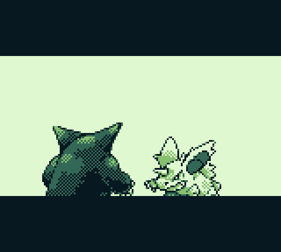
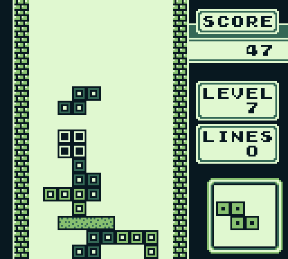
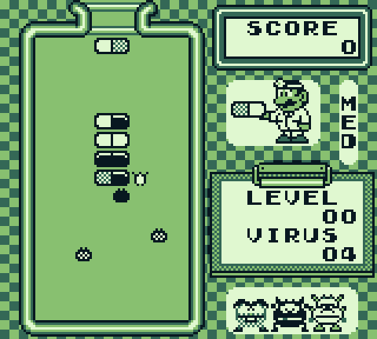
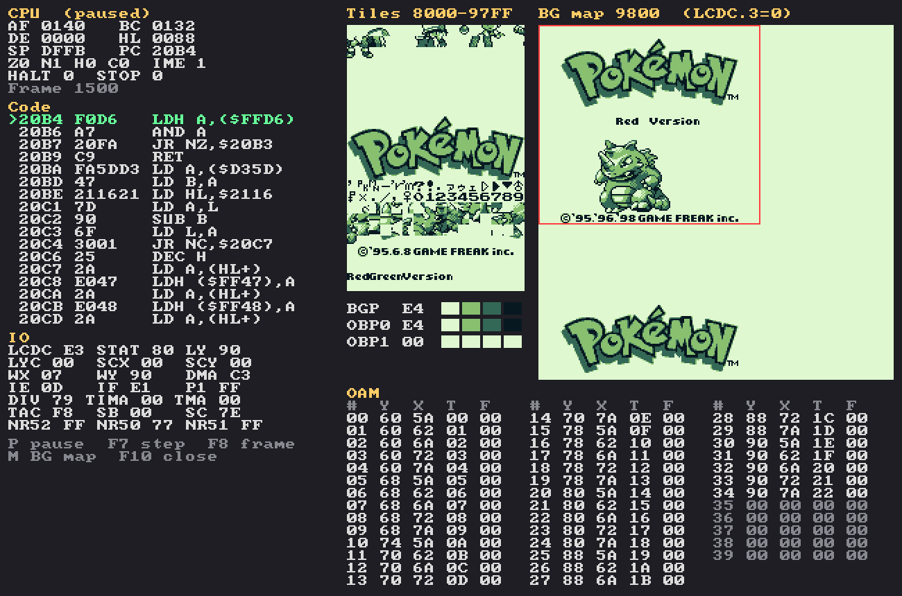

# Game Boy Emulator

An original Game Boy (DMG) emulator written in C++20 with SDL3.

<p>
  
  
  
  
</p>



## Features

- M-cycle accurate CPU and timer, scanline PPU, all four sound channels
- Cartridge types: ROM only, MBC1, MBC2, MBC3 with real-time clock, and MBC5
- Battery saves, 4 save-state slots, fast-forward and pause
- Debugger window with disassembly, tile/map/sprite viewers and breakpoints
- Headless mode for automated test ROMs
- Passes Blargg's CPU and timing tests, most of Mooneye's acceptance tests and dmg-acid2

Game Boy Color–only games and Game Boy Advance ROMs are not supported.

## Build

Requires CMake, a C++20 compiler and SDL3.

```sh
cmake -B build -DCMAKE_BUILD_TYPE=Release
cmake --build build
./build/gbemu path/to/game.gb
```

## Controls

| Key | Action | Key | Action |
|---|---|---|---|
| Arrows | D-pad | Tab (hold) | Fast-forward |
| X / Z | A / B | P | Pause |
| Enter | Start | F1–F4 / Shift+F1–F4 | Save / load state |
| Backspace | Select | F10 | Debugger |

Press **H** in the emulator for the full list. Gamepads are supported.

## Tests

```sh
python3 tests/run_tests.py
```

This downloads the Blargg, Mooneye and dmg-acid2 test ROMs and runs them headless.
